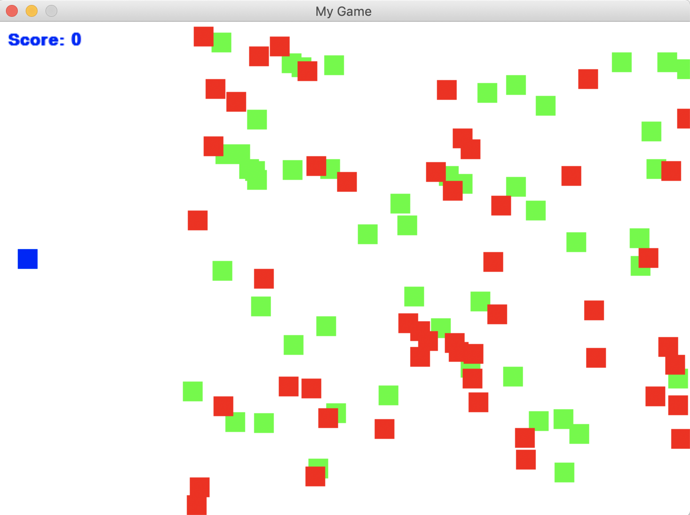

# DynamicSpriteCollecting
Game in which the player (blue) collects good sprites (green), but must avoid bad sprites (red) to finish with the highest score possible. The player's score can be tracked by the blue output string on the top left corner. 

The player is controlled by the left, right, up, and down keys. The player is also limited from going off the screen. There are sound effects for every collision. The game is completed once the player collects all the green sprites. Once the game is complete you have the option to play again by just clicking on the game screen. For every new game, the positions of the green and red sprites are always randomized.

## Getting Started

### Prerequisites

Other versions of python and pygame are possible to run the program. 
The following are the versions used when compiling the game:

Python Version: 3.6.3 :: Anaconda custom (64-bit)

Pygame Version: 1.9.6

## Running the Game

Navigate to the local directory where all the files from this repository are located and run the python game on the terminal.

```
python spriteCollecting.py
```

### Example Run

Game when starting up.



Player half way done collecting the good sprites.


Display when the game is finished.


